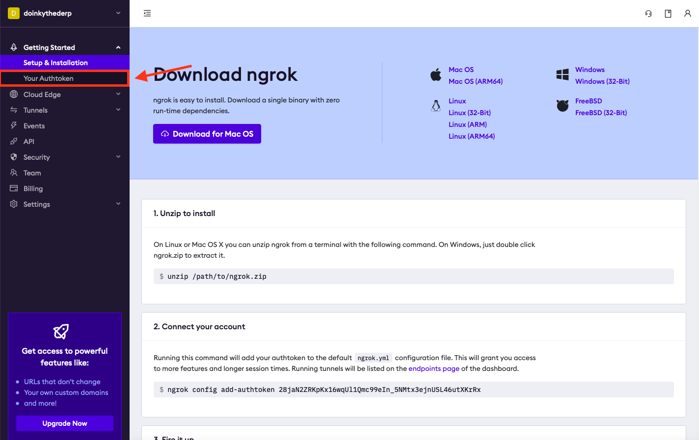
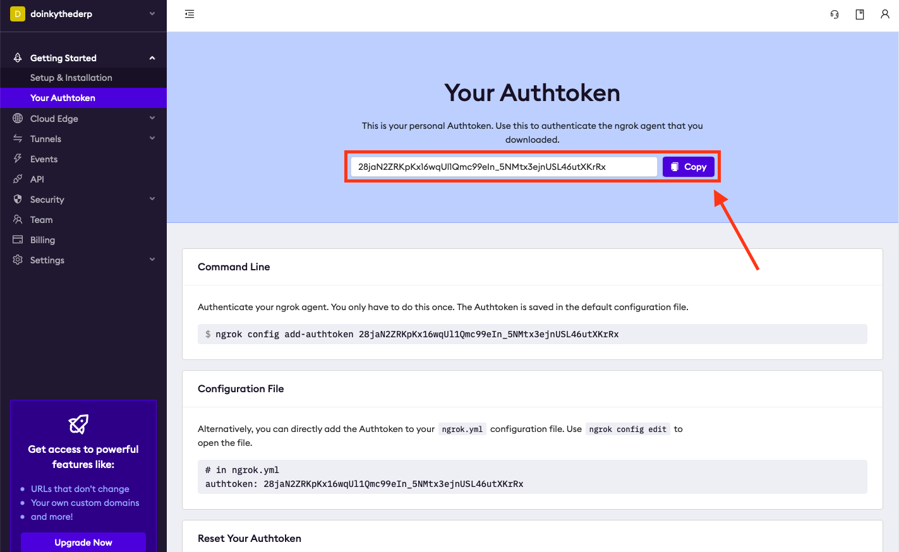
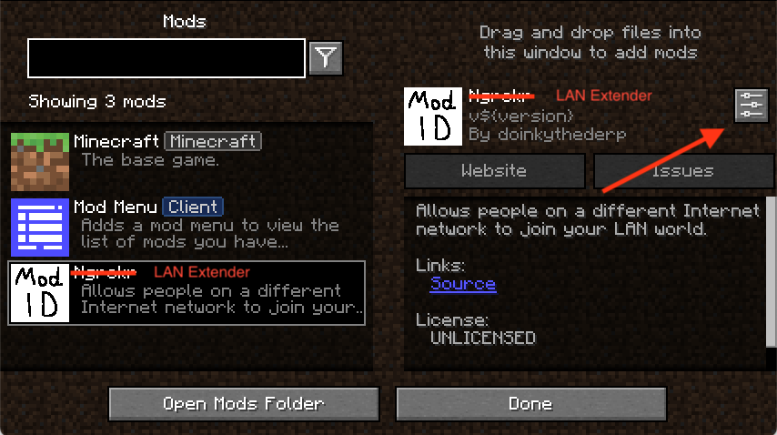
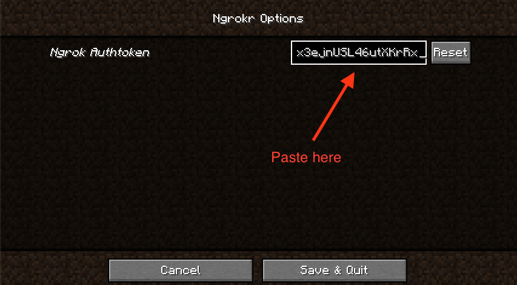
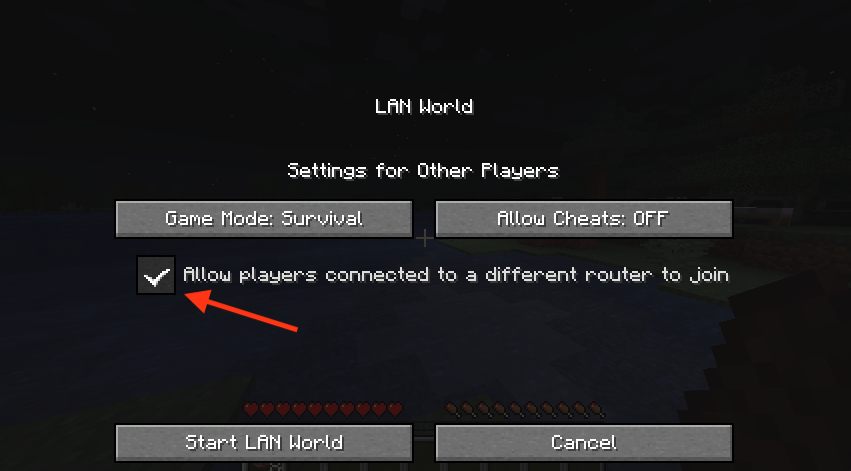
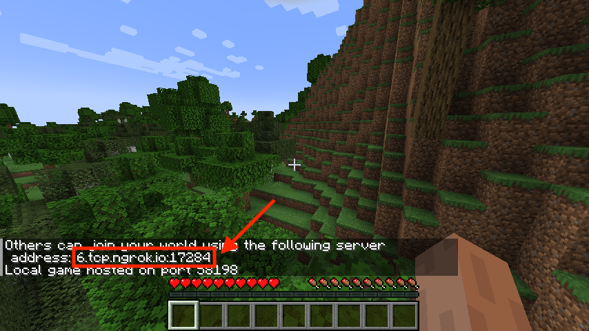

# Ngrokr: The world connector

Ngrokr generates a server address when you start your LAN worlds that lets others connect – even if they're connected to a different router!

## Installation

Ngrokr is a [**Fabric**](https://fabricmc.net) mod. Put the Ngrokr jar-file in the `mods` folder in your game directory. [**Mod Menu**](https://www.curseforge.com/minecraft/mc-mods/modmenu) is strongly recommended but technichally not required for configuration.

## Setup

Ngrokr requires an [**ngrok**](https://ngrok.com) account to function. [**Click here**](https://dashboard.ngrok.com/signup) to sign up. You should receive an email asking you to verify your email address. Doing so is recommended, but not neccesary for the mod to work. Once you've logged in, you should see the page below. Click on "Your Authtoken" – there is no need to download or install ngrok.

Then, copy the authtoken, and paste it into the Ngrokr configuration screen.

Please note that the authtoken pictured in this guide will not work if you try to use it. You need to create and use your own. Also, if you accidentally leak your authtoken, you can return to the website above to reset it.

## Usage

Once you're in the world you want others to be able to join, click Open to LAN in the game menu and click the checkbox to allow people connected to a different router to join.

Anyone who you share the address with can join your world like a normal multiplayer server.

